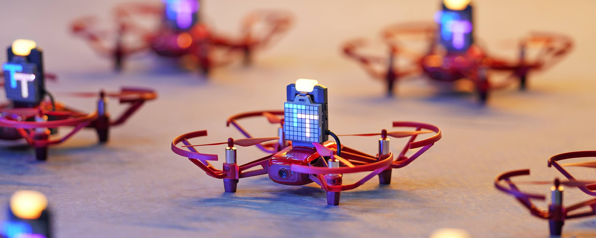
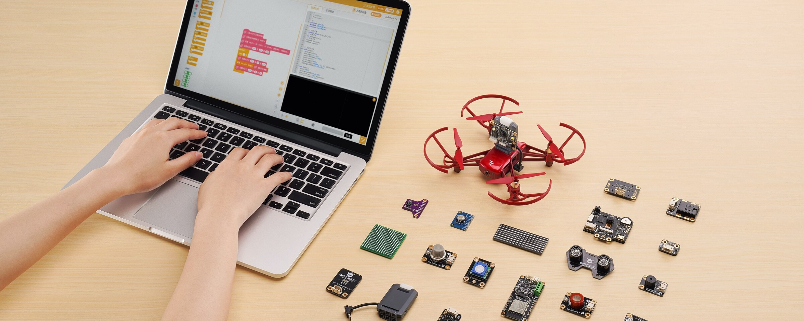

## Robomaster TT

drone Tello + extensión Open Source con opción a incluir sensores de terceros

Programable en Python, arduino, micropython, DroneBlocks y Scratch

The TT is equipped with a powerful ESP32 microcontroller board to provide Arduino and MicroPython open-source coding platforms that supports Arduino, MicroPython and Scratch offline coding. Students can see their coding come to life, by writing custom codes to change the colors and flash frequency of the TT’s programmable RGB 256 all-color LED light or create simple shapes, animations and letter scrolling effects on the 8X8 Red and Blue LED dot matrix screen fitted on the TT. 

Incluye:

Dron
Matriz 8x8 Leds RGB ¿$239?

[How to program?](https://tellopilots.com/threads/how-do-you-code-the-rmtt.6233/)