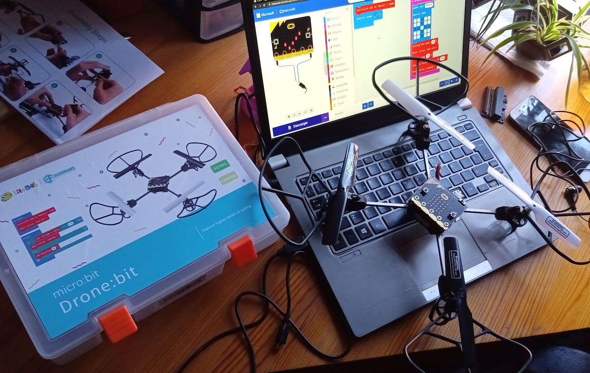

## Drone:bit

Drone controlado por una micro:bit

[Extensión](https://github.com/elecfreaks/pxt-Dronebit)

[Código](https://github.com/elecfreaks/pxt-Dronebit/blob/master/main.ts)

Se comunic con la micro:bit vía uart

[Documentación](https://www.elecfreaks.com/learn-en/microbitKit/Drone_bit/index.html)

[Producto](https://www.elecfreaks.com/micro-bit-drone-bit-kit-without-micro-bit-board.html)

Es bastante más grande de lo que pensaba
(añadir comparación con trello)

### Programación

[Ejemplo supersencillo](https://makecode.microbit.org/_7yMTRKMdyRPz)

## Ejemplo 1

* Inicializacion
* Al pulsar el botón A:
    * Mostramos Check
    * Esperamos 5 segundos
    * Despegamos!!!
    * 2 segundos parado
    * Avanzamos 100 cm
    * Rotamos 90º a la izquierda
    * Subimos 100 cm
    * Musiquita
    * Aterrizamos

[Proyecto](https://makecode.microbit.org/_Xryg9dWLy3HW)

### Volando en cuadrado

* Inicializacion
* Al pulsar el botón A:
    * Mostramos Check
    * Esperamos 5 segundos
    * Despegamos!!!
    * Repetimos 4 veces
        * Avanzamos 100 cm
        * Rotamos 90º a la izquierda
    * Musiquita
    * Aterrizamos

[Proyecto](https://makecode.microbit.org/_RMsLWid2tK6K)

